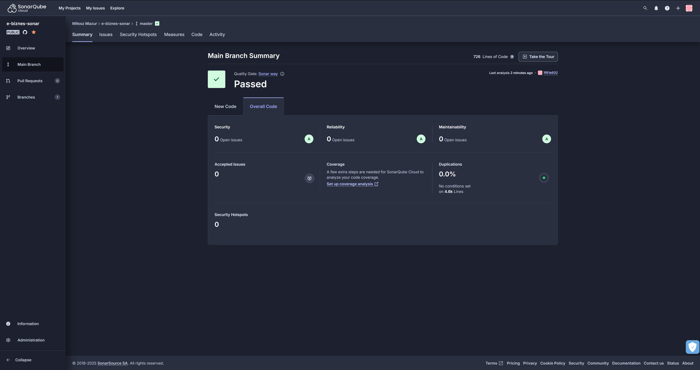

# SonarCloud Integration

This repository integrates **SonarCloud** for static code analysis, ensuring high-quality and secure code by eliminating **bugs, code smells, vulnerabilities, and security issues**.

## 🛠️ Project Requirements

To meet the requirements of **Task 7 (Sonar)**, the following steps have been completed:

- ✅ **Added the client and server applications to SonarCloud.**
- ✅ **Achieved 0 bugs, 0 code smells, 0 vulnerabilities, and 0 security issues.**
- ✅ **Implemented Sonar widgets displaying results in this README.**
- ✅ **Added linter hooks for the server application in Git hooks.**

## 📌 Grading Criteria

| **Grade** | **Requirement**                                                                         |
| --------- | --------------------------------------------------------------------------------------- |
| **3.0**   | Added linter to the server application using Git hooks.                                 |
| **3.5**   | Eliminated all **bugs** from the server application.                                    |
| **4.0**   | Eliminated all **code smells** from the server application.                             |
| **4.5**   | Eliminated all **vulnerabilities** and **security issues** from the server application. |
| **5.0**   | Eliminated all **bugs and code smells** from the client application.                    |

## 📊 SonarCloud Badge

## 📷 Sonar Test Summary

## 📜 License

This project is licensed under the **MIT License**.

---

### **🎯 Goal Achieved: 0 Bugs | 0 Code Smells | 0 Vulnerabilities | 0 Security Issues ✅**
